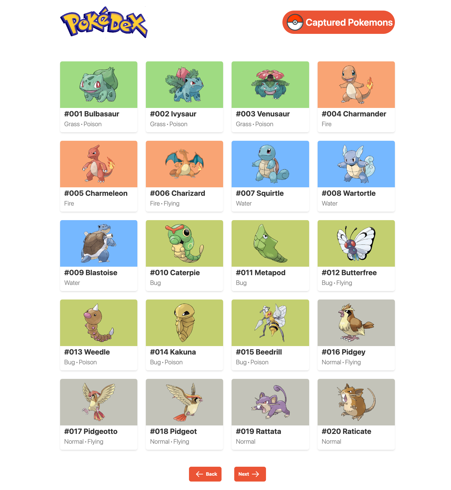
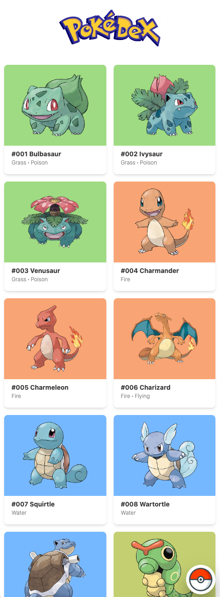

# Pokedex Application

## [Live Site](https://gotta-catch-em-all.vercel.app/)

## Project Description

React.js application utlizing the Pokemon API that displays a paginated list of Pokemon cards with their picture, name, id numbers and type(s). You can click on a specific pokemon to view additional details in a pop up modal such as height and weight, base stats such as HP, attack & defense. You can also capture Pokemon and give them a custom nickname, date they were captured and the level they were captured at. There is a page to display all your captured pokemon and see all the details provided at time of capture. All the captured Pokemon and currently selected Pokemon are saved to local storage to persist all the data.

---

## Technologies Used

- React.js
- Tailwind CSS
- Pokemon API
- Local Storage






## Quick Start

Download the zip file of the project or clone the repo on your machine.

```
$ git clone https://github.com/daltonotineru/pokedex.git
```

---

If you're using Yarn ~ in the project directory, you can run:

### `yarn install`

This will install necessary dependencies

Still in the project directory, you can run:

### `yarn start`

This runs the app in the development mode.
Open [http://localhost:3000](http://localhost:3000) to view it in your browser.

The page will reload when you make changes.

---

If you're using NPM ~ in the project directory, you can run:

### `npm install`

This will install necessary dependencies

Still in the project directory, you can run:

### `npm start`

This runs the app in the development mode.
Open [http://localhost:3000](http://localhost:3000) to view it in your browser.

The page will reload when you make changes.
